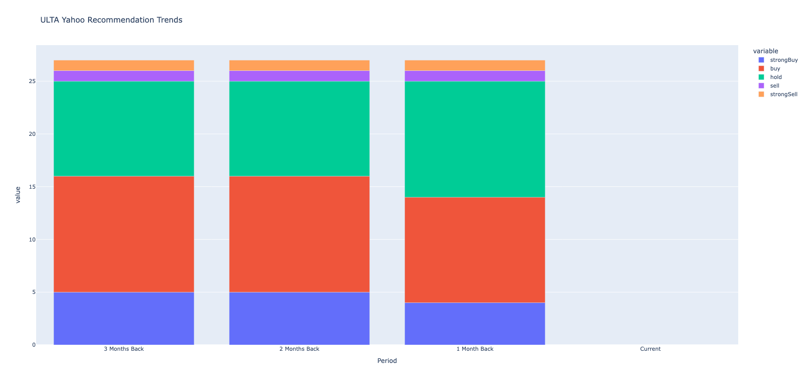
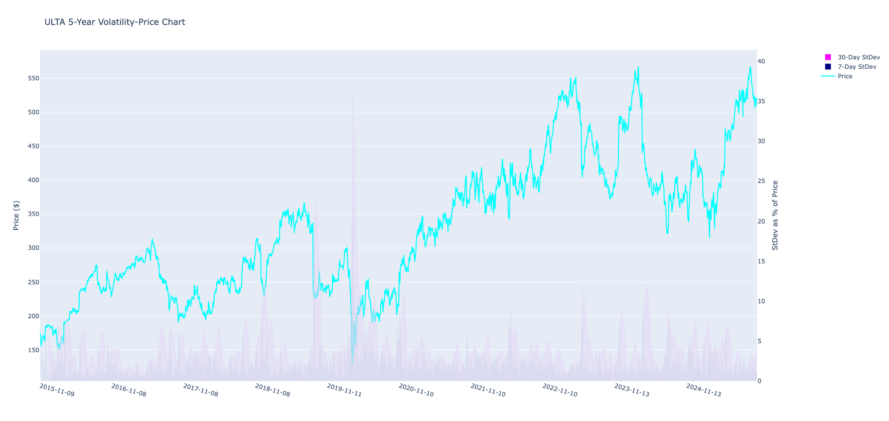
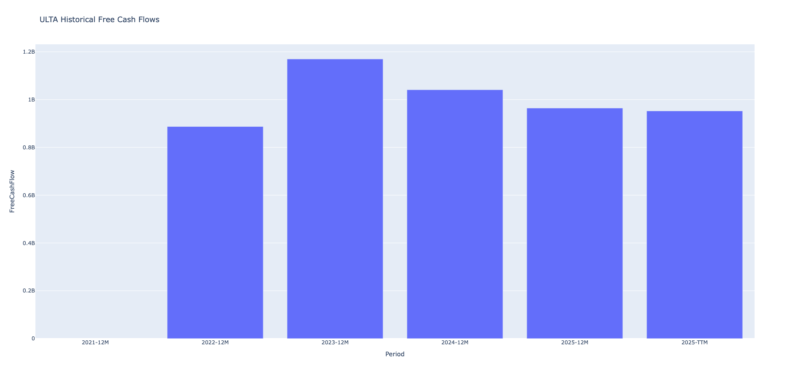
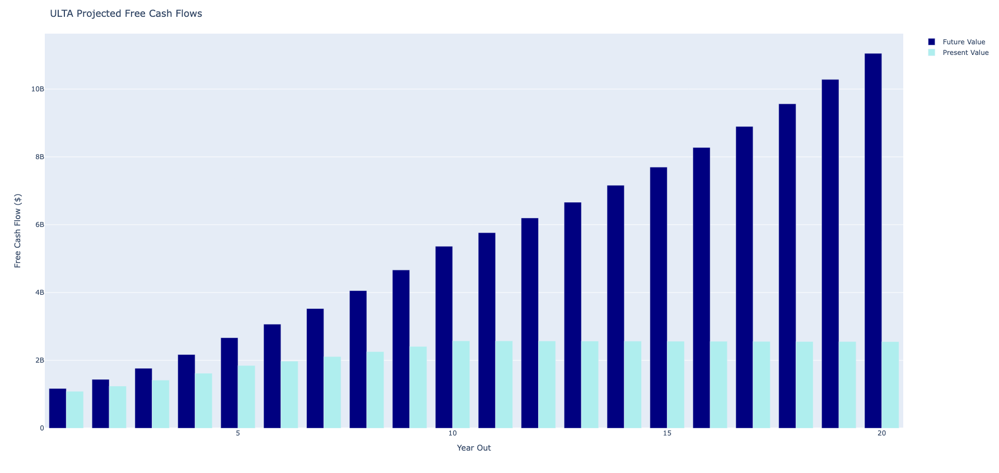
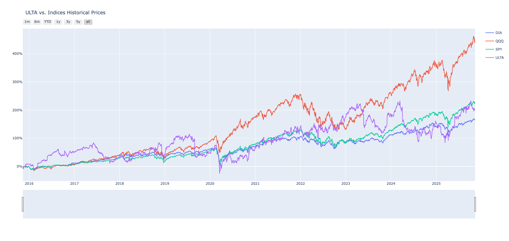

# Simplifi

[](LICENSE)  
[](#)

Simplifi is a compact Python library for financial analysis and stock-market data visualization. It combines data from multiple sources (notably Yahoo Finance via `yahooquery`) to provide a toolkit for historical data analysis, option pricing, valuation models, and simple forecasting.

## Features

- Historical data analysis
  - Fetch and process historical data from Yahoo Finance (`yahooquery`).
  - Compute averages, log returns, and moving averages (50/200 day) used in analysis and charts.
  - Optional interactive OHLC candlestick charts (Plotly) including volume and moving averages.

- Options analysis
  - Black–Scholes implementation for option pricing and tools to price an options chain.

- Valuation models
  - Dividend Discount Model (Gordon Growth) for simple intrinsic valuation.
  - Discounted Cash Flow (DCF) helper (if financials are available).

- Risk & return helpers
  - Fetch current 10-year Treasury yield (risk-free rate) and compute Cost of Equity / CAPM expected return.

- Simple forecasting
  - Regression-based short-term price forecasts with high/low bands and optional Plotly visualization.

## Installation

Clone the repo and install dependencies. Two common options are shown below; choose the one you prefer.

Using a standard venv:

```bash
git clone https://github.com/skmcwilliams/simplifi.git
cd simplifi
python3 -m venv .simplifi_venv
source .simplifi_venv/bin/activate
pip install -r requirements.txt
```

Using the included Pipfile (pipenv):

```bash
git clone https://github.com/skmcwilliams/simplifi.git
cd simplifi
pipenv install --dev
pipenv shell
```

Notes:
- The repository includes a `Pipfile` and `requirements.txt`. For reproducible installs prefer the pinned file if available.
- Tested on Python 3.10–3.13 (your mileage may vary on earlier versions).

## Usage

Below are concise, copy-paste-friendly examples. Most methods return a pandas DataFrame or a float (noted where relevant).

Minimal example

```python
from simplifi import Simplifi

s = Simplifi('SO')
df = s.get_historical_data()          # returns pd.DataFrame
print(df.tail())
```

Black–Scholes example

```python
from simplifi import Simplifi

s = Simplifi('MMM')
opts = s.blackscholes()               # returns pd.DataFrame of options pricing
print(opts.head())
```

OHLC chart with visualization

```python
s = Simplifi('F')
s.get_historical_data(make_ohlc=True) # opens interactive Plotly chart in browser
```

Dividend Discount Model

```python
s = Simplifi('KO')
intrinsic = s.ddm_valuation()         # returns float intrinsic value
print(intrinsic)
```

Regression forecasting (10 trading days)

```python
s = Simplifi('CSCO')
pred = s.run_regression(dte=10, make_viz=True)  # pd.DataFrame with prediction bands, returns glidepath in chart via plotly in browser
```

## Example charts

Below are the example charts included in this repository. Each image demonstrates a visualization produced by the library and includes a short description of what the chart shows.

### OHLC (candlestick) chart


An interactive OHLC candlestick chart showing price action with 50- and 200-day moving averages and volume displayed beneath. Useful for technical analysis and inspecting individual trading days.

### Forecast / Regression chart


Shows the regression-based forecast (prediction line) with high/low or confidence bands over the prediction horizon. This chart is produced by `run_regression(..., make_viz=True)`.

### Yahoo Finance recommendations


A bar chart of analyst recommendation trends sourced from Yahoo Finance (e.g., buy/hold/sell counts over time or recent snapshots).

### Volatility chart


Displays rolling volatility or standard deviation measures for the ticker over time — helpful to visualize changing risk levels.

### Historical Free Cash Flows


Historical free cash flows (FCF) across reported periods — used as inputs for valuations such as DCF.

### Projected Free Cash Flows


Projected or modeled future free cash flows used to estimate intrinsic value via a DCF approach.

### Ticker vs Indices comparison


Comparison of the ticker's performance against benchmark indices or ETFs (e.g., SPY,QQQ,DIA) to show correlation and relative performance.

## API (high-level)

Primary public methods on the `Simplifi` class (one-line summaries):

- `Simplifi(ticker: str)` — constructor for a ticker symbol.
- `get_historical_data(period='1y', interval='1d', make_ohlc=False) -> pd.DataFrame` — fetches OHLCV and computed columns (moving averages, returns).
- `blackscholes(...) -> pd.DataFrame` — prices options using Black–Scholes model for the ticker's entire option chain.
- `ddm_valuation(...) -> float` — simple Dividend Discount Model valuation (Gordon Growth), prints valuation variables and returns value.
- `dcf_valuation(...) -> float` — Calculates DCF Value based on expected future cash flows
- `get_10_year() -> float` — returns current 10-year Treasury yield (risk-free rate).
- `get_capm_return(target_return: float=0.085) -> float` — estimates expected return via CAPM.
- `run_regression(dte: int, make_viz: bool=False) -> pd.DataFrame` — simple regression forecast with bands.

Refer to the docstrings in the source for parameter details and optional keyword arguments.

## Dependencies & Compatibility

- See `requirements.txt` and `Pipfile` for pinned dependencies.
- Tested on Python 3.10, 3.11 and 3.13 in a local virtualenv. Key packages include `pandas`, `numpy`, `plotly`, `yahooquery`, `scipy`, and `scikit-learn`.

## Contributing

Contributions are welcome. Suggested workflow:

1. Fork the repo and create a feature branch.
2. Create a virtualenv and install requirements.
3. Add tests for new behavior (there are currently no automated tests in the repository; please add pytest-based tests in `tests/` when possible).
4. Open a PR with a descriptive title and summary of changes.

Style notes: follow PEP8; using `black` for formatting is encouraged.

## License

This project is licensed under the terms in the `LICENSE` (GPL) file.

