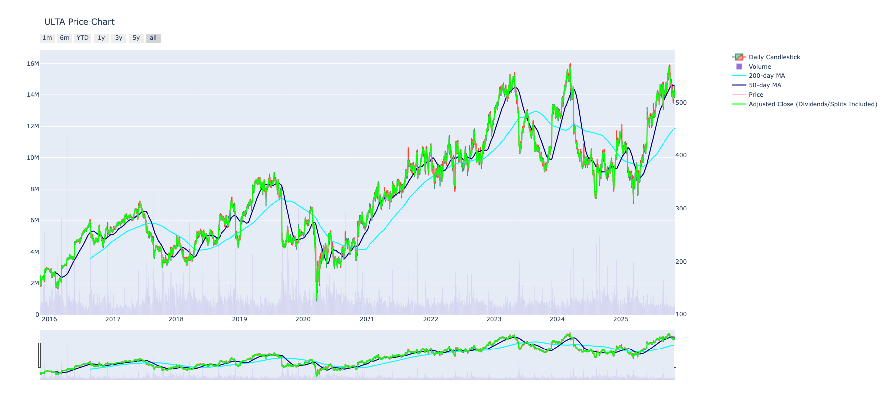
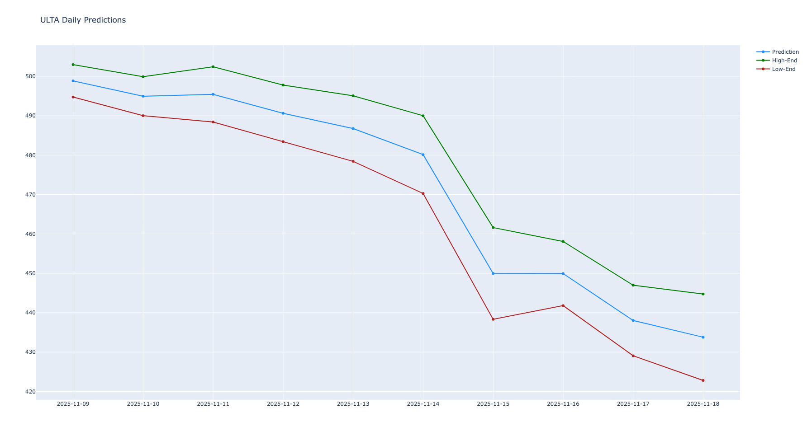

# Simplifi

A comprehensive Python library for financial analysis and stock market data visualization. This library combines data from multiple sources including Yahoo Finance to provide a rich set of financial analysis tools.

## Features

- **Historical Data Analysis**
  - Fetch and process historical data from YahooQuery (Yahoo Finance)
  - Calculate average prices and logarithmic returns for BlackScholes model, along with moving averages for technical analysis
  - Option to generate interactive OHLC (Open-High-Low-Close) candlestick chart in browser
  - Chart includes additional measures such as moving average and volume
  - Interactive buttons to select various time-based views and select/unselect data points
  - Returns historical dataframe with additional calculations

- **Options Analysis**
  - Black-Scholes option pricing model implementation
  - Prices entire options chain and returns pandas dataframe of option data

- **Dividend Discount Model**
  - Fetch stock valuation based on Gordon Growth Model calculations
  - Cost of Equity calculations
  - Risk-free rate analysis based on 10yr Treasury

**Get 10 Year**
  - Returns float of the 10-year treasury, a standard risk-free-rate
  - Cost of Equity calculations
  - Risk-free rate analysis based on 10yr Treasury

**Calculation CAPM Return**
  - Returns float expected return using Capital Asset Pricing Model, prints results and assumptions to terminal
  - Based on standard annual 8.5% target return, can be overriden using optional target_return parameter

  **Regression Model**
  - Regression model calculates future price for ticker based on time-series data, ticker price trends, and standard deviations
  - Returns dataframe consisting of the prediction as well as the high and low-end possibilities of price from Day0(today) to the user-defined number of trading days for which to predict
  - Plotly chart is returned via browser, providing visual of the same

## Installation

```bash
git clone https://github.com/skmcwilliams/simplifi
```
### Quickstart

```bash
python3 -m venv .simplifi_venv
source .simplifi_venv/bin/activate
pip install -r requirements.txt
```

## Usage

### Basic Usage

```python
from simplifi import Simplifi

# Create an instance for a specific stock
stock = Simplifi('ULTA')

# Get historical data
historical_data_df = stock.get_historical_data()

# Get Black-Scholes option valuations
options_analysis_df = stock.blackscholes()

```

### Advanced Features

#### OHLC Chart Generation
```python
# Get historical data with OHLC chart
historical_data_df = stock.get_historical_data(make_ohlc=True)
```

Example OHLC chart output:



Example Forecast chart output:



#### Dividend Discount Model Valuation
```python
# Calculate stock valuation using DDM
ddm_valuation = stock.ddm_valuation()

# Future price prediction using regression 10 days out
predicted_df = stock.run_regression(dte=10,visualize=True)
```

## Dependencies

- numpy
- pandas
- plotly
- yahooquery
- beautifulsoup4
- requests
- scipy
- scikit-learn

## Data Sources
- Yahoo Finance (via yahooquery)

## Notes
- Features require internet connection for real-time data
- OHLC charts include 50-day and 200-day moving averages
- Black-Scholes calculations use the current 10-year Treasury rate as the risk-free rate

## License

See the LICENSE file for details.

## Contributing

Please feel free to submit a Pull Request.
